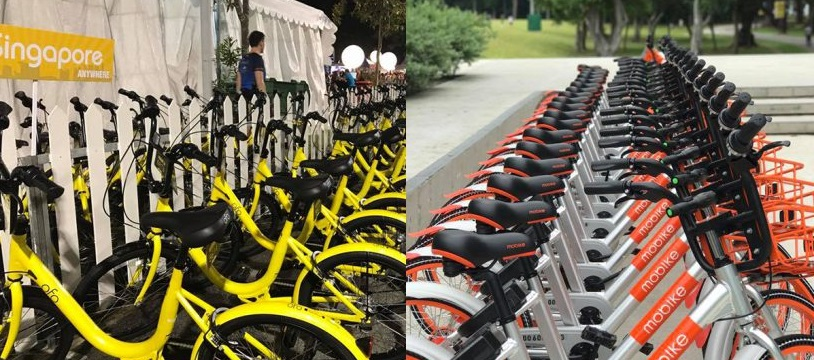

# Bike Sharing Dataset Analysis and Predictive Modeling
## Background
According to [Wiki](https://en.wikipedia.org/wiki/Bicycle-sharing_system), a bicycle-sharing system, public bicycle system, or bike-share scheme, is a service in which bicycles are made available for shared use to individuals on a short term basis for a price or free.  Nowadays, most of us are quite familiar with bike sharing due to the popularity of smart phones and the [dockless bike](https://en.wikipedia.org/wiki/Bicycle-sharing_system#Dockless_bikes) sharing service. The following picture captures the most famous two brands of bike sharing in China and Singapore.

In this project, I try to analyze a [public bike sharing dataset](https://archive.ics.uci.edu/ml/datasets/bike+sharing+dataset) hosted on the famous UCI machine learning repository, which contains two-year historical log corresponding to years 2011 and 2012, contributed by [*Capital Bikeshare*](https://www.capitalbikeshare.com/) in Washington, D.C. 
## Objective
The main purpose of this project is to **learn and practice data analysis, data visualization and machine learning modeling** using Python and related packages including *numpy*, *pandas*, *seaborn* and *matplotlib* etc. I choose this dataset because it involves multiple features, including both categorical and continuous ones, and it is closely related with our daily life since we are  all familiar with bike sharing nowadays. Besides, this project also demonstrates **the power of data and the potential benefits machine learning can bring to business development**.

In 2016, the McKinsey Global Institute (MGI) published a report, *The age of analytics: Competing in a data-driven world*, emphasizing the importance and potential of Big Data and machine learning:
> Big data’s potential just keeps growing. Taking full advantage means companies must incorporate analytics into their strategic vision and use it to make better, faster decisions.

Specifically, regarding this bike sharing dataset, I want to address the following concerns using exploratory data analysis (EDA) and machine learning techniques:
- reveal **the most important factors** that affect the count of total rental bikes.
- build a **predictive model** for bike rental demand estimation by mining the pattern in the dataset
- propose some well-designed, targeted **incentive schemes** to promote bike sharing, which can be monetary or non-monetary.
## Implementation and Source Code
Programming language and involved packages
- Python programming,
- `numpy` and `pandas` for data manipulation,
- `matplotlib` and `seaborn` for visualization.

**Read the source codes and associative, detailed illustrations in a Jupyter Notebook online [here](./notebook/bike.ipynb).**

(I have also prepared a repository dedicated to data visualization using Python, where I summarized knowledge and my experience. Check it: [Python visualization](https://github.com/Zhou-Xiaoyu/Python-Visualization).)

